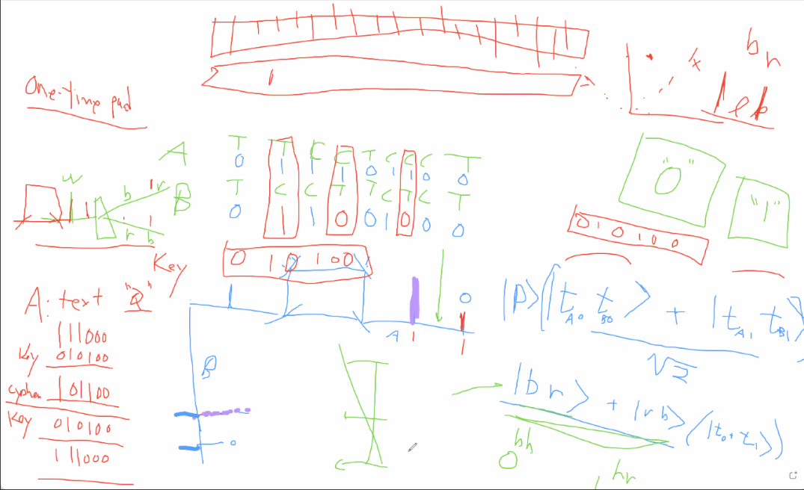
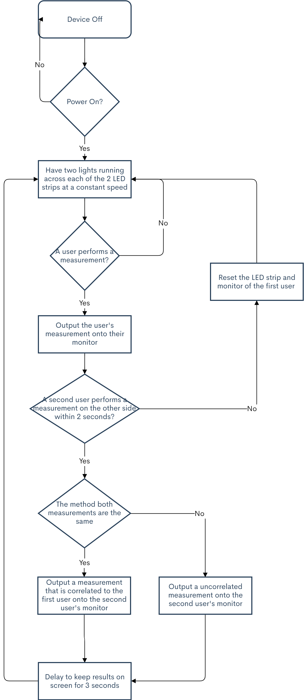
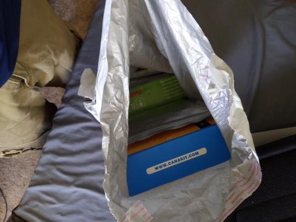

# Andrew Situ Notebook

# 9-9-2021 - Discussion with Professor Kwiat

The Team had a meeting with our sponsored professor, Professor Kwiat, about the project to clarify some of the project. Additionally, he explained how the educational device would imitate how quantum entanglement would behave in the real world through the zoom whiteboard.

# 9-11-2021 - Team meeting for project proposal

We decided to start the project proposal and look for some parts. I was looking up the different types of sensors we could use as input for the two sections of 3-foot LEDs so that there would be inputs at every 2 inches for the prototype. Initially I was looking at already created touch capacitive switches, but they were only around 3 inches each at $7 per module which would be much too expensive for the given budget. I also looked at flex sensors and resistive sensors, but they had their own problems. Ian ended up finding a capacitive touch board that allowed for 12 capacitive touch inputs that we would have to make ourselves out of some conductive material. 

# 9-14-2021 - Meeting with TA
Had a meeting with our TA and got feedback on our Project Proposal. We needed to fix the Block Diagram that Ian created since it did not include which lines where what and the fixed the coloring for data and electric lines.

# 9-15-2021 - Finished the project proposal for the class
Our group met up at 6 and finished working on the project proposal that was being submitted for the class. I worked on filling out the problem and solution slide in addition to creating some visual aids for the proposal. I also helped fill out the description for the subsystems and block diagram.

# 9-23-2021 - 9-30-2021 - Worked on the design document
Worked on the design documents. After going to the document check on 9/24, we modified some of our requirement and verification. In addition, we were looking for all the parts we planned on using. Planed on using a microcontroller to process 2 VGA outputs and control the LED and touch capacitors. Looked up ways a microcontroller can process some VGA output. Found some sources such as http://tinyvga.com/ , https://blog.thomaspoulet.fr/bit-banged-vga/. Looked into getting a knob so our device can have some physical speed control. Evan one of the TAs in the course notified us that driving VGA from a microcontroller might be outside the scope of this course in an email.

# 10-3-2021 - Meeting with a TA about our microcontroller
Had a video meeting with Evan who mentioned some limitations for the touch capacitors not working after 4 feet of wires and the fact that we should not drive VGA displays with a microcontroller. We talked about alternatives for the display output and the concerns with the touch capacitors did not affect out intended use case. Some alternatives included using multiple microcontrollers one to process logic and two more for each monitor. We also started talking about using a raspberry pi to drive the displays while processing everything else on the microcontroller. Evan also mentioned that we should probably use ps2 keyboards since their protocol are easier to use.

# 10-5-2021 - Design document flow chart
I created a flow chart to add to our design document for how the software would run. 

We had the design document review with the professor and some of the TAs. We talked to the professor and were allowed to use the raspberry pi to output our display for this project.

# 10-6-2021 - 10-11-2021 - Finding parts and working on the PCB
Found a new microcontroller since we are moving to outputting the display on the raspi. We looked for one that could transmit data to the raspi and process 2 LEDs, two ps2 keyboards, and the capacitive touch breakout boards which needed a spi and sda pin on the microcontroller. We also started working on the PCB to try and get it in for the first round of PCBs. Ended up not creating the design in time for that.

# 10-13-2021 - Finished PCB
Ian finished the first draft of our PCB and check it with a TA. He also ordered it.

# 10-15-2021 - Ordered parts
We ordered all of our parts that we decided on and messaged our sponsored professor to order the LEDs, raspberry pi and power supply.

# 10-20-2021 - Getting all the parts
I went to professor Kwiat office and grabbed all the parts that came in from Amazon. Additionally, the Ian received the PCBs and the other parts that we have ordered has arrived in the business office.

# 10-23-2021 - Ordering other parts
Realized we forgot to order some of the resistors and other small parts for the PCB and placed the order.

# 10-27-2021 - Resubmitted design document
We modified our block diagram and tolerance analysis of the previous one since we decided to use a microcontroller to process the video output instead of the original microcontroller idea. For the tolerance analysis I added some analysis on how the copper wire would affect the capacitive touch breakout board. The final result was in line with what Evan mention where the wires stopped being reliable after 3 feet.

# 10-28-2021 - First day going to the Lab
We had a meeting with our TA and then Ian started soldering the microcontroller and header pins onto the PCB. While he was doing that I was starting up the raspberry pi and installing the os and libraries we were planning on using. I also started testing the LED using the controller that came with the package and figuring how that worked with one strand. In addition, I also fried one of the LEDs strips trying to figure out how the library worked.

# 11-2-2021 - Testing the LEDs
Professor Kwiat asked us to try out various combination of visuals for the LEDs. I used the rspi_281x library to run through all the colors of the rainbow and brightnesses so the professor had a good idea on how that looked like. Ian finished soldering the microcontroller and diodes to the PCB.

# 11-4-2021-Meeting with our TA
We asked our TA if we could borrow one of the USB programmers and a HDMI monitor from her lab.

# 11-5-2021-Missing another part
Me and Ben talked to another student in the lab, and we figured out that our microcontroller does not work without an external crystal oscillator. We order a 16MHz oscillator and then went to work on the code raspi code for the LEDs so that it could pulse across a single strand.

# 11-7-2021-Started testing capacitive touch
I was able to get the raspi code to work with 2 LED strips. Ian soldering on header pins for our capacitive breakout boards. Once those we soldered on, I tested a very simple program to see if the capacitive touch worked and then tried to combines that code for the capacitive touch with our LEDs so that when someone touch it the lights would stop. We also tested the max distance wires could go reliability on the breakout boards and the distance was around 3 ft from the board. Additionally, we were able to get two strips and two breakout boards working within the program. The capacitive touch sensor was ran using the mpr121 library that from ada fruit where the product was listed

# 11-9-2021-Meeting Professor Kwiat in Loomis
I meet with the professor to demonstrate how the LEDs are looking. However the raspi os somehow stopped working and I was only able to display the default outputs of the LEDs to the professor.

# 11-11-2021-Fix Raspi
We had to reinstall the os onto the raspi and grab all the libraries again. I also started committing code to the git repository after rewriting what I had. Ian started soldering wires onto the breakout board but we figured out the wire that we soldered onto the board was not the best and so we decided to solder different wires onto a different board for testing another day. This was because the wire didn’t have a consistent output for the capacitive touch sensors.

# 11-12-2021-Osillator arrived
Ian soldered the oscillator onto the microcontroller, and we were able to program it. We tested a simple LED blink test and it worked after figuring out what the pin in the Arduino code with respect to the pins on the microcontroller.

# 11-14-2021-Capacitive touch testing
Ian soldered more wires onto 2 capacitive touch boards that we used for testing which took around 2 hours. I started adding logic into the LED code with the capacitive touch sensor data. 

# 11-16-2021-Working on the monitor code
I also looked into how to start displaying text onto a window and decided to use the pygame library. I found some resources such as using socket programming to run a server on the program logic then output a signal to the client which would update the pygame windows. I couldn't figure out how to get the communication to work with the sever and 2 clients and the program kept crashing. We also figured out that soldering on a small piece of copper tape onto the breakout board made the measurement more reliable due to the surface area of the conductive increasing.

# 11-17-2021-Working on a small demo
Ian finished soldering on the copper tape to 2 breakout boards which had 12 sensors each. While he was doing that, I finally got the server to send signal to two client to display a one or a zero depending on what the user typed. I ended up opening two socket connections from the server to two client programs that would run pygames to display a screen for each monitor.

# 11-18-2021-Working on the logic for code
Started working on implementing the different types of measurement on one strand. Was able to get a color measurement how bugs with indexes so it was not in the middle. This was due to the fact that we place the capacitive touch sensors backwards with the 0th touch sensor near the 144th pixel on the LED and going to the 11th sensor to around the 56th pixel. This is due to the fact that each copper strip was measured to be 2 inches and for the LED strip every 2 inches it is about 8 pixels. Once I flip that in the actual version it would be much easier to correctly index the touch sensors with the LED. However I made a simple demo with for the mock demo with that current setup.

# 11-20-2021-Trying to get PS/2 keyboard to work on microcontroller
Ian soldered one of the PS/2 keyboard headers onto the microcontroller while I got the library and Arduino code onto my laptop. Once he finished soldering the header in and plug in a usb keyboard we were able to program the keyboard code onto the microcontroller however the keyboard was not responding. We checked to make sure the microcontroller was working by running the blink test and that was fine. However, we could not figure out what was wrong with the keyboard and ended up pushing this issue to the side for now.

# 11-21-2021-Getting the capacitive and LED code to work on microcontroller
Me and Ian found similar libraries that we used for the raspi for the microcontroller both from ada fruit, Adafruit_MPR121 for the touch capacitor and Adafruit_Neopixel for the LEDs. I was able to run the LED code on the microcontroller. Then I was able to run the touch capacitor code on it. However, when I integrated them together I ended up putting a small bug in the way I was testing it which took about 30 minutes to debug. The problem ended up being I was indexing the capacitive touch wrong within the ardinuo code and once that was resolved the test code ran perfectly.

# 11-22-2021-Trying to get serial communication between raspi and microcontroller
Since the capacitive touch and LED code worked for the microcontroller, we then tried to get the communication to work between the raspi and microcontroller. We a couple of sources to that such as https://www.teachmemicro.com/raspberry-pi-serial-uart-tutorial/ , and https://medium.com/geekculture/tutorial-serial-connection-between-raspberry-pi-and-arduino-253a52099b2a. However once the communication starts after around 20 messages the communication terminates by itself. We tried a couple of fourm post but none of those solutions seemed to work so in the end we decided to try and get everything done on the raspi with all the logic first before trying to fix the microcontroller code.

# 11-28-2021-Shopping
The professor messages us that the tubing was not going to be in on time for our demonstration, so we went to home depot to purchase some tubing and ended up getting some planks of wood to put them on. We also purchased tape and some plastic containers to hide the wires in.

# 11-29-2021-Putting the demo together
We constructed the entire demo putting the wire and tubing together and placing all the touch capacitor in the correct place on the board. Ian also started soldering wire to extend some female connectors to the capacitive touch boards and male connectors to some wires so we can easily connect them to the raspi. The physical project at this point is complete. All the components of the project is working.

# 11-30-2021-Debugging and more soldering
I accidently did not connect the capacitive touch boards to common ground and then couldn’t figure out why it was not working. I ended up reinstalling the raspi os to try and fix that problem which wasted about 30 minutes. Once we figured out the problem, I finished all the logic code for and combined the monitor code with the LED/touch logic and everything was running fine.

