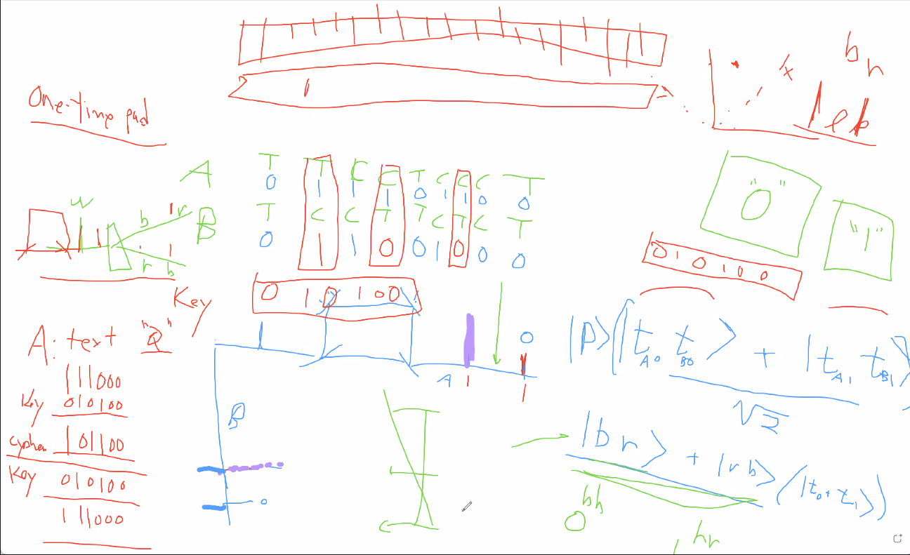

# 9/9/21 - First meeting with Professor Kwiat

We finally were able to meet with Professor Kwiat. He ran us through his vision for the project, as he was the one sponsoring it. We were able to listen to him for about an hour
while he drew a rough design of what we were going to build, along with some math that helped us with the understanding of quantum physics (see 9-9 Kwiat Drawing.PNG). This was
very useful as it allowed us to get a brief understanding of what we were going to take on.

# 9/11/21 - Second meeting with Professor Kwiat

We met with the professor again to go over our proposal and talk about budget. He was willing to cover the costs of making the project a little higher quality only if we were 
able to make a working prototype with cheaper parts. While this is doable, there is going to be a bit of extra work in our project now. Work on the proposal continues.

# 9/14/21 - First meeting with TA

