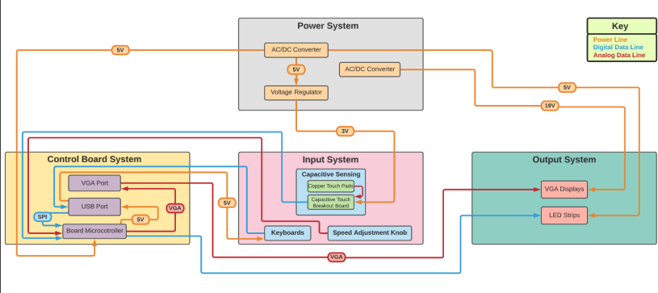
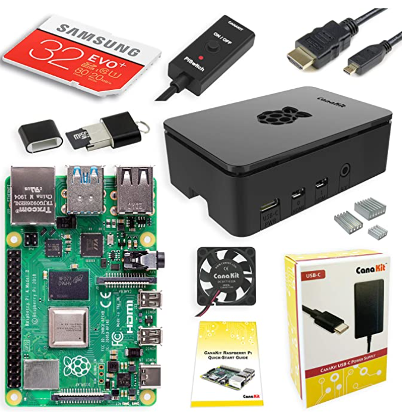
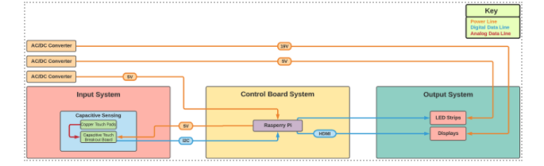
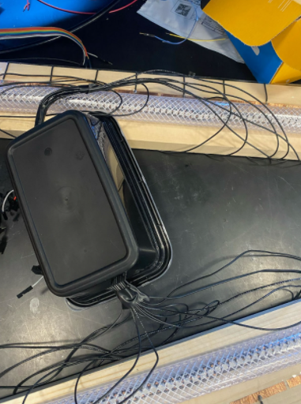
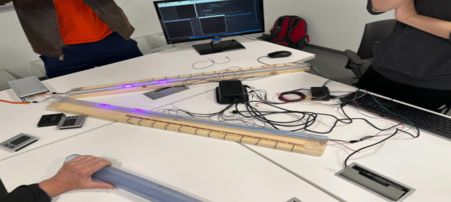

# 9/9/21 - First meeting with Professor Kwiat

We finally were able to meet with Professor Kwiat. He ran us through his vision for the project, as he was the one sponsoring it. We were able to listen to him for about an hour
while he drew a rough design of what we were going to build, along with some math that helped us with the understanding of quantum physics (see 9-9 Kwiat Drawing.PNG). This was
very useful as it allowed us to get a brief understanding of what we were going to take on.

# 9/11/21 - Second meeting with Professor Kwiat

We met with the professor again to go over our proposal and talk about budget. He was willing to cover the costs of making the project a little higher quality only if we were 
able to make a working prototype with cheaper parts. While this is doable, there is going to be a bit of extra work in our project now. Work on the proposal continues.

# 9/14/21 - We met with the TA to discuss the block diagram

We had another meeting with Josephine today to discuss our Design Document. We were instructed to change the block diagram to include data and power lines with specific colors. She also gave some feedback on the visual aid, which we are going to make a bit more sophisticated. Overall, the meeting went well, but we still have a lot left for design

# Week of 9/20 - Design Document

We are finally doing the rest of our design document. We have been able to finalize the first draft of our block diagram, and things are looking good. We are having nightly meetings on discord to just work through stuff a little bit at a time. We have also started looking for parts and microcontrollers. None of us have a huge knowledge of microcontrollers, so the process is just a lot of research. We will have to get help with how everything goes together.

# Week of 9/27 - Finished Design Doc and Microcontroller Help

I don't think we had too many problems with our design document overall. During meetings with Professor Kwiat, we were able to get help with our problem and proposed solution, visual aids, and high level requirements. The only remaining issue is the parts list, which includes a microcontroller. I reached our to Professor Arne and Evan, a TA for this class. The plan is to meet with either one of them to discuss how we would do our project using a microcontroller.

# Week of 10/4 - Meeting with Evan, Parts List, and the Introduction of the Raspberry Pi

Well, the meeting with Evan was pretty condescending, but helpful. Turns out that it would be nearly impossible to run the LEDs, touch sensors, and displays all from a microcontroller. We were recommended the ATMEGA328 as the microcontroller we should use for this project. After a meeting with Professor Arne, we have been given permission to use a Raspberry Pi 3 to help with the displays only. This is a huge boost for our team, as it makes the project significantly easier. We are also researching new parts given this new information and are hoping to have everything researched and purchased by next week. Professor Kwiat ordered the Raspi we would be using for this project pictured below.

# Week of 10/11 - Parts and PCB Ordering

This was a pretty chill week, we ordered all the parts we needed as well as the PCB. Ian worked with a TA to make sure our PCB was debuggable and wasn't too complex.

# Week of 10/18 - Got Parts and Reworking Design Document

We finally got all our parts and PCB, which surprisingly didn't take long. However, after the Design Review, we knew we had to change a lot about our Design Document. We basically spent the week redoing a bunch of parts of that Design Document so we wouldn't lose as many points when it was graded.

# Week of 10/25 - The Beginning of Lab Work

Our team finally had everything we needed to begin working in the lab. We mainly spent the week just testing out LEDs because Professor Kwiat wanted a bunch of videos of the lights working. He was happy with the end result and we began our work. All the testing was done on the Raspi because we haven't tried microcontroller yet.

# Week of 11/1 - Work Continues and First Disaster

We found a great resource online for the LEDs, which was a WS2812 library for the LEDs we purchased. This library allowed us to pulse lights and change color, brightness, etc. However, we tried getting code onto our microcontroller with some pretty big issues. A helpful classmate told us that he had the exact same microcontroller but it required a crystal osciallator to work properly. We knew it would take a week or so to arrive, so we ordered the oscillator and kept working on the LEDs. Overall, that progress was very good and the library was super helpful.

# Week of 11/8 - Beginning of Capacitive Touch and Display Testing

We got the LEDs to work just fine, but now it was time to work with the capacitive touch boards and the displays. We found out really quickly that the HDMIs on the Raspi worked perfectly for dual screens, where we could plug in two monitors and drag things across two screens. We also began testing the capacitive touch boards using references online. The capacitive touch boards were very finicky and hard to actually receive the input at first, but we found out that they just needed a larger surface area. We were able to solder the wires to copper tape and the touch sensors worked flawlessly. At the time, we are still only using the Raspi, as we can't quite get the Microcontroller to work as expected.

# Week of 11/15 - Setting up for the Mock Demo

We spemnt the week testing and creating a small little demo for Josephine on some cardboard. It demonstrates the main functionality of our project without it being the final product. We still have 1.5 weeks until the demo, and we had to transtion to only using the Raspi as the issues with the Microcontroller communicating with the Raspi were so bizarre that we didn't know what else to do. The mock demo went great and worked as expected. Now to finalize code and build the real thing.

# Week of 11/29 - Preparing the Demo Prototype for Demo

Professor Kwiat did not order the tubing early enough, so the team had to take a field trip to Home Depot to buy a couple pieces of hardware and tubing in order to have a working demo prototype. The final result was very clunky and unappealing, but absolutely did the job in terms of showing the functionality and accuracy. After our demo went well, we showed Professor Kwiat the finished protoype for the first time and he was very happy with the end result. He introduced us to two students, Benjamin and Derek, who would be taking over our work for the next semester, as well as sharing ideas with us about how they will build off of the base we created.

# Week of 12/6 - Presentation, Final Report, and Knowledge Transfer to Professor Kwiat and his Team
Our presentation went quite well and the staff reviewing our presentation seemed happy that Professor Kwiat was happy. We finished our final report according to the guidelines and are now just meeting with Professor Kwiat to give him all our resources, hardware, and code. I am very excited to see what this project will bring next, and I think we will still be referenced by the Professor and his new team this upcoming semester.
