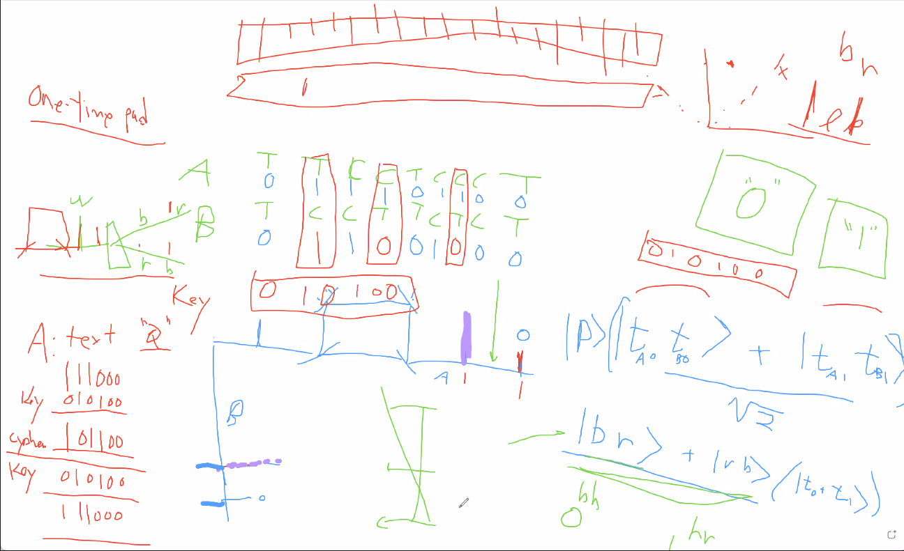

# Meeting 9/9/21 With Professor Kwiat
The team met with Professor Kwiat over a Zoom call which was around an hour in length, and wherein he illuminated his vision for the final product and explained basic principles of quantum entanglement and its practicality as it relates to computer cryptography.

# Meeting 9/11/21 With Professor Kwiat
The team once again met with Professor Kwiat with the aim of discussing the budget-quality balance of the project, and to what extent the physics depatment may be able to subsidize the project in order to produce a higher quality product. All the while keeping in mind the end goal of holding a public educational display in Loomis Laboratory.
